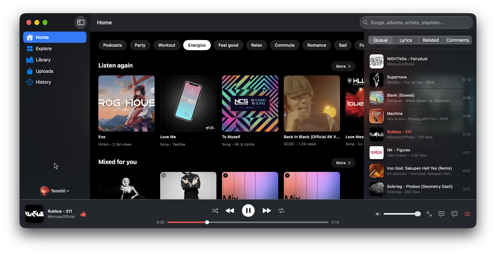
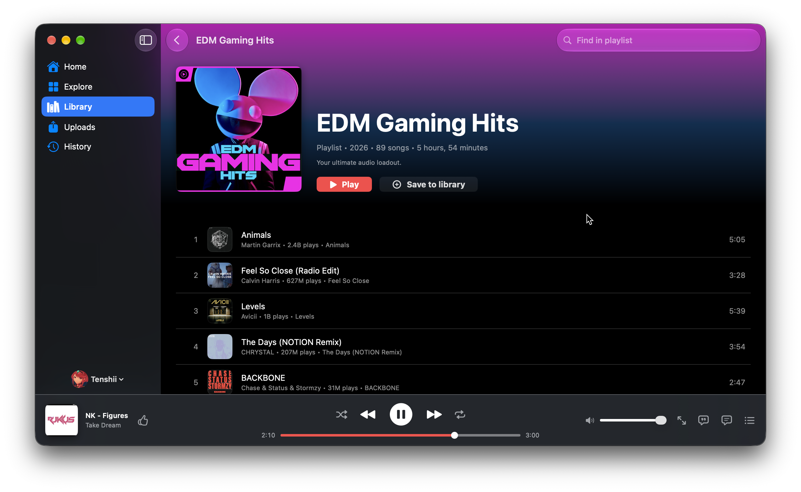
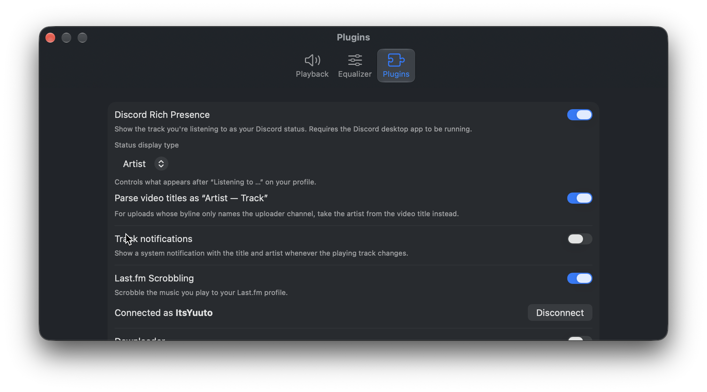

# YT Music

YT Music is a native macOS client for YouTube Music, built with SwiftUI. It
uses YouTube's private InnerTube API directly from Swift. Playback, stream
resolution, and signature decoding stay inside the app, with JavaScriptCore
used for the player code that signs stream URLs.

## Screenshots



The app combines browse shelves, search, a docked playback bar, and a
now-playing inspector with Queue, Lyrics, Related, and Comments tabs.



Playlist pages show artwork, playlist actions, search within the playlist, and
the track list with playback controls.



The native settings window includes a Plugins tab for enabling and configuring
integrations.

## Features

- Playback with crossfade, queue controls, media-key support, and a 10-band equalizer
- Home, Explore, Search, album, artist, playlist, and entity pages
- Personal library, likes, listening history, and uploads
- Playlist creation and editing, including adding and removing tracks
- Upload, browse, and delete support for your own music files
- Timed lyrics from YouTube Music, LRCLIB, and Musixmatch
- Queue, lyrics, related tracks, and comments in the now-playing inspector
- Radio and autoplay that continue the queue after a track ends
- Menu-bar commands and keyboard shortcuts
- Plugins for Discord Rich Presence, track notifications, Last.fm scrobbling, and downloads

## Requirements

- macOS 27.0 or later
- Xcode 27.0 or later
- A Google account for signed-in features. Sign-in happens in an embedded web view, and credentials are stored in the Keychain.

## Build

Open `YT Music.xcodeproj` in Xcode and run the `YT Music` scheme.

From the command line:

```sh
xcodebuild -scheme "YT Music" -destination 'platform=macOS' build
```

## Architecture

The app uses `@Observable` state injected through SwiftUI's environment. The
project defaults to `@MainActor` isolation, while networking, parsing, and
stream resolution types that run off the main actor are explicitly marked
`nonisolated` or implemented as actors.

| Directory | Responsibility |
| --- | --- |
| `Auth/` | Web-view sign-in, cookie-derived request headers, and Keychain persistence |
| `InnerTube/` | InnerTube client, response types, parsers, stream resolution, and playback reporting |
| `Models/` | Domain types for feeds, tracks, playlists, lyrics, comments, history, and uploads |
| `Features/` | Home, search, library, uploads, entity pages, and now-playing screens |
| `Player/` | AVPlayer playback, queue state, crossfade, persistence, equalizer, and spectrum analysis |
| `Settings/` | Playback preferences, equalizer settings, plugin configuration, and download location |
| `Plugins/` | Registry-driven Discord, notification, Last.fm, and downloader integrations |

## Stream resolution

`StreamResolver` selects an AAC or MP4 stream that AVPlayer can decode.
`SignatureDecipher` fetches YouTube's current `base.js` player code and runs
the signature and `n` parameter solver in JavaScriptCore. This part depends on
YouTube's current player build and may need updating when that code changes.

## Testing

Tests use Swift Testing and run without network access. They cover signature
and `n` decoding, stream format selection, credential headers, parsing, lyrics,
playlist behavior, and queue and playback state.

```sh
xcodebuild -scheme "YT Music" -destination 'platform=macOS' test
```

## Disclaimer

YT Music is an unofficial client for personal use. It is not affiliated with,
endorsed by, or sponsored by Google or YouTube.
